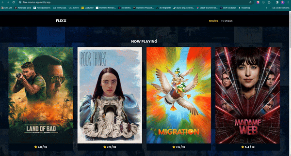

# [Flixx-movie-app](https://flixx-movies-app.netlify.app/)

A HTML, CSS and Vanilla JavaScript project from Modern JS course by Brad T.

This project was created to focus on working with public APIs, make use of asynchronus capabilities of JS using fetch API provided from WebAPIs.

### Project Checklist

- Fetch Data about popular movies and tv shows from [The Movie Database API](https://developer.themoviedb.org/docs/getting-started) using **fetch()**;
- using **asyn/await** syntax for working with Promise Obects.
- use **DOM API** to dynamically update page components
- use **swiper.js** library to implement smooth swiping on all devices

### Project Demo

Link to project website: https://flixx-movies-app.netlify.app/

Website Preview:

